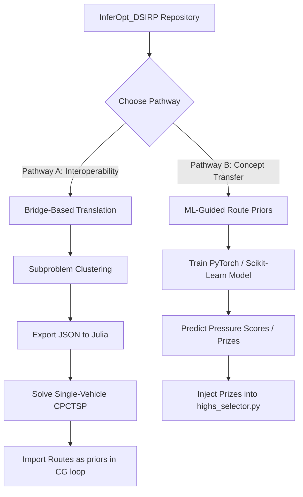

# InferOpt DSIRP Analysis & Integration Plan

This document analyzes the dynamic and stochastic inventory routing solver from [InferOpt_DSIRP](https://github.com/tonigreif/InferOpt_DSIRP) and explores how its methodology and tools can be integrated with our current Python-based [ROADEF 2016 IRP Tools](file:///Users/graydonsnider/PycharmProjects/Vrp_stuff/README.md).

---

## 1. Comparative Overview

We compare the design decisions, mathematical formulations, and engineering constraints of the two repositories below:

| Dimension | ROADEF 2016 IRP Tools (Current Workspace) | InferOpt DSIRP (`tonigreif/InferOpt_DSIRP`) |
| :--- | :--- | :--- |
| **Problem Complexity** | **Industrial-scale Multi-Vehicle/Trailer IRP** - Heterogeneous fleet & compatibilities - Driver shifts, rest rules, driving time limits - Multi-drop/multi-reload routes per shift - Hourly time windows & safety stock constraints | **Canonical Single-Vehicle DSIRP** - Homogeneous single vehicle - Single depot and single commodity - Order-Up-to (OU) replenishment policy - Daily steps, no complex driver/shift duration constraints |
| **Tech Stack** | Python (`highspy`, `numpy`, `uv`) | Julia (`JuMP.jl`, `Flux.jl`, `InferOpt.jl`, `Gurobi.jl`) |
| **Uncertainty Model** | **Quantile Hedging & Scenario Backtests** - Forecast paths compiled into time-dependent quantile profiles - Solved deterministically on the hedged instance - Validated against Monte Carlo scenario runs | **End-to-End Decision-Focused Learning** - Machine learning model (PINN) maps current inventory state + forecast distributions to customer "prizes" - Differentiability achieved via Fenchel-Young Loss |
| **Core Algorithm** | **Matheuristic ALNS + Column Generation (CG)** - ALNS destroys/repairs route selections - Master problem solves shift selection via HiGHS - Quantity-repair QP optimizes delivery volumes | **Prize-Collecting TSP (CPCTSP) Oracle** - Solves CPCTSP MIP for routing decisions after each update - Differentiability achieved via Fenchel-Young Loss |
| **Solver Dependency** | **HiGHS** (open source, no license required) - Optional Gurobi support | **Gurobi** (commercial license required for CPCTSP oracle) |

---

## 2. Strengths & Limitations of `InferOpt_DSIRP`

### Strengths
- **True End-to-End Decision-Focused Learning**: Rather than separating the forecast from the optimization (which can lead to sub-optimal decisions due to the "predict-then-optimize" mismatch), `InferOpt` trains the ML layer to output parameters (prizes) that lead to optimal route choices under the oracle.
- **Interpretable Parameterization**: The linear/physics-informed neural network utilizes clear state features (current inventory level, quantiles of demand, holding cost, penalty cost, and contextual features) to output a single score per customer (the prize).
- **Fast Real-Time Inference**: Once trained, the ML policy runs extremely fast (it only evaluates a forward pass of a simple model followed by a single-vehicle CPCTSP solve).

### Limitations / Obstacles for ROADEF Integration
1. **Language & Ecosystem Boundary**: Porting or compiling Julia-based neural networks (with `Flux.jl` and `InferOpt.jl` dependencies) into a pure Python environment requires setup overhead (e.g. `juliacall` or subprocessing).
2. **Model Mismatch (Single vs. Multi-Vehicle)**: The CPCTSP formulation in `InferOpt_DSIRP` assumes a single vehicle. ROADEF 2016 has a complex fleet of drivers, trailers, and trucks. Differentiating through a full multi-vehicle ROADEF shift scheduler is mathematically and computationally prohibitive.
3. **Gurobi Dependency**: `InferOpt_DSIRP` uses Gurobi for the CPCTSP oracle. Our workspace is designed to work out-of-the-box with the open-source HiGHS solver.

---

## 3. Integration Pathways

We propose two distinct pathways for integrating or utilizing these tools:

### Pathway A: Bridge-Based Integration (Interoperability)
We can utilize our existing candidate generation architecture to load routes solved by the Julia model.
1. **Cluster Subproblems**: For a complex ROADEF instance, we identify geographic clusters that are typically served by a single vehicle.
2. **Export to JSON**: Convert the subproblem's coordinates, demands, and inventory parameters to the JSON format expected by `InferOpt_DSIRP` (as seen in `instances/*.json`).
3. **Execute Julia Policy**: Call the trained Julia model via subprocess to obtain a single-vehicle routing schedule.
4. **Import as Route Priors**: Import the resulting routes into our column generation pool. Our codebase already has a structured loader for historical/external routes in [`roadef_tools/solver/route_priors.py`](file:///Users/graydonsnider/PycharmProjects/Vrp_stuff/roadef_tools/solver/route_priors.py)!

### Pathway B: Concept Transfer (Differentiable Priors in Python)
Instead of running Julia directly, we can adopt the core concept of **Machine Learning-guided pricing/prizes** directly inside our Python codebase:
1. **Feature Engineering**: For each customer at start-of-day, construct a feature vector matching `InferOpt`'s design:
   - Current Days of Inventory (DOI)
   - Holding cost vs. penalty cost ratio
   - Quantiles of demand forecast over the lookahead horizon
2. **Train a PyTorch/Scikit-learn Model**: Train a lightweight model to predict a "pressure/routing priority" value for each customer.
3. **Integrate with HiGHS Selector**: Use the predicted priority values to dynamically scale the *Pressure Pricing* rewards in [`roadef_tools/solver/highs_selector.py`](file:///Users/graydonsnider/PycharmProjects/Vrp_stuff/roadef_tools/solver/highs_selector.py). Currently, our pressure pricing relies on a hand-tuned heuristic; ML-guided prizes could significantly improve the selection of which customer shifts to include under uncertainty.

---

## 4. Recommended Next Steps

1. **Standalone Validation**: Run `setup_environment.jl` and `evaluate_benchmark.jl` in the cloned `scratch/InferOpt_DSIRP` folder to verify the Julia setup and observe the solver's training and evaluation performance.
2. **Design an ML-Guided Prior Experiment**: If the user approves, we can draft a Python-based regression module in `roadef_tools/solver/` to learn customer priority weights from simulation backtests and use them to guide route selection.
